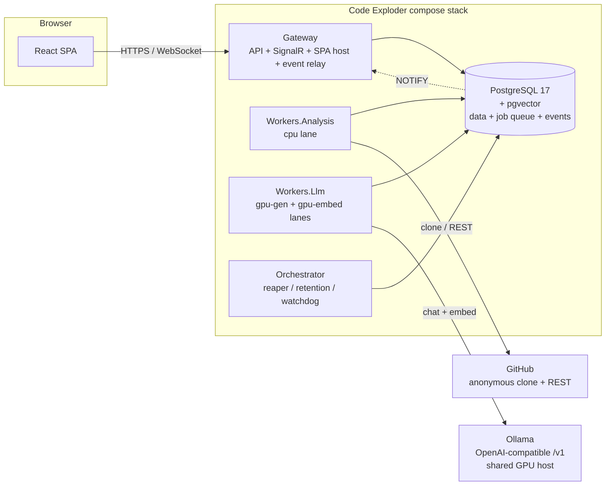

# 00 — Overview

## Context

Code Exploder turns a public GitHub repository (or a pull request) into an
interactive, self-paced onboarding tutorial. The generated experience is meant to feel
like a 1:1 session with an expert in the codebase:

0. **Intro** — what the code is, what the product does, who uses it.
1. **Whiteboard architecture tour** — diagrams explained progressively, opening up
   complexity step by step: data flows, user interactions, product scenarios.
2. **Engineering practice** — how the code is built, tested, and released/deployed.

Plus per-section **quizzes** (optional, never gating) and a **Q&A chat** with the
virtual expert, grounded in the analysis knowledge base with file/line citations.

The user flow: a home page with a left pane of session history and a new-session form;
pasting a repo/PR URL starts a queued analysis with live progress; the finished
experience supports skipping familiar sections and drilling deeper into others.

## Fixed decisions

- **Stack**: .NET 10 backend (ASP.NET Core minimal APIs, SignalR), React 19 + Vite +
  TypeScript SPA, PostgreSQL 17 + pgvector.
- **LLMs**: locally hosted via Ollama (OpenAI-compatible `/v1`), sharing a single
  24 GB GPU with other consumers — all inference is queued.
- **Scope v1**: public GitHub repos only (anonymous clone + public REST API). Private
  repos later, behind the same connector interface.
- **Auth**: pluggable `Auth:Mode` — `DevBypass` (Development only), a simple gate in
  production (forward-auth / shared credential), OIDC slot reserved.
- **Features**: all four pillars in scope, phased — tutorial experience, quizzes,
  Q&A expert, PR-diff explainer. See [milestones](08-milestones-and-risks.md).

Architectural patterns and the UI design language are ported from a prior in-house
ASP.NET Core + React application ("the reference app"); deployment conventions come
from the private HomeInfra repository.

> **Docs hygiene rule:** this repository is public. Never include LAN IP addresses or
> other home-network material details in committed files. Referring to the *existence*
> of endpoints ("the Ollama host", "ai-vm") is fine; concrete addresses live only in
> the private HomeInfra repo.

## Guiding principles

1. **Deterministic first, LLM last.** Repo mapping, chunking, component detection,
   diagram *rendering*, and citation resolution are all deterministic. The LLM
   supplies only judgment: summaries, narrative, diagram *content specs*, quiz
   content, answers.
2. **The LLM never emits fragile syntax.** All LLM outputs are schema-validated JSON
   (one repair retry with the validator error appended). Mermaid is rendered
   deterministically from validated `DiagramSpec` JSON — no Mermaid linting sidecar,
   no syntax failures.
3. **Every LLM call is a queue job** bounded to ≤ ~90 s (input packed to a per-stage
   token ceiling, output capped). This bounds wall-clock per job and is what keeps
   interactive Q&A latency tolerable on a non-preemptive single GPU.
4. **One generation model per run.** VRAM model swaps are minutes-scale; the planner
   picks a model once per analysis. The embedding model is small and always resident.
   Q&A reuses the model recorded on the analysis, so chat never triggers a swap.
5. **Progressive publish.** Tutorial sections become readable as they are generated —
   the intro is typically readable ~20 minutes into a mid-size repo's ~1 h analysis.
   All content is pinned to a commit SHA and can never silently drift from the repo.

## System architecture



- **Gateway** — ASP.NET Core: minimal-API endpoints, the `SessionHub` SignalR hub,
  static hosting of the built SPA, and the event-relay `BackgroundService` that
  `LISTEN`s to Postgres and fans events out to hub groups.
- **Workers.Analysis** (cpu lane, concurrency 2–4) — acquire, repo-map, chunk, plan,
  deterministic diagram rendering, finalize.
- **Workers.Llm** — one gpu-gen poller (concurrency 1) for all generation jobs and one
  gpu-embed poller for embedding batches.
- **Orchestrator** — lease reaper (requeues jobs whose worker died), finished-job
  purge, workspace retention, stuck-run watchdog.
- **PostgreSQL** — single store for domain data, the job queue, vector search, and the
  event log. No separate queue or message-broker infrastructure.

The user's original sketch included ML sidecars (ASR/vision); those drop out — there
is no audio/video in this product, and embeddings come directly from Ollama's
`/api/embed`. The "rule engine" role is filled by the deterministic **run planner**
(component detection, token budgeting, model selection) rather than a rules library.

## Solution layout

```
codeexploder.slnx            (+ Directory.Build.props, global.json — net10.0, nullable,
                              TreatWarningsAsErrors, pinned SDK; reference-app conventions)
src/CodeExploder.Domain      records/enums: Analysis, Component, DiagramSpec, Section, …
src/CodeExploder.Storage     NpgsqlDataSource, MigrationRunner + Migrations/V####__*.sql,
                             JobQueue (with join extension), stores (raw SQL, no ORM),
                             ObjectStore, PgPipelineEventBus
src/CodeExploder.Llm         LlmClient (OpenAI-compatible, SSE streaming, starved-output
                             guard), OllamaEmbedClient, LlmReadinessGate, TokenEstimator,
                             versioned prompt loader
src/CodeExploder.GitHub      clone/fetch wrapper, REST client, rate-limit backoff
src/CodeExploder.Analysis    deterministic stages: RepoMapper, Chunker, ComponentDetector,
                             ImportGraph, RunPlanner, DiffMapper, MermaidRenderer
src/CodeExploder.Pipeline    LLM stages + Prompts/*.v1.txt + JSON-schema validators with
                             repair-retry loop
src/CodeExploder.Qa          Retriever (vector + FTS + trigram RRF fusion), ContextPacker,
                             AnswerLoop, CitationResolver
src/CodeExploder.Gateway     endpoints, Hubs/SessionHub, event relay, auth handlers, SPA host
src/CodeExploder.Workers.Analysis   cpu-lane worker executable
src/CodeExploder.Workers.Llm        gpu-lane worker executable (gen + embed pollers)
src/CodeExploder.Orchestrator       maintenance services
webui/                       React SPA (see 05-ux.md)
deploy/                      parameterized Dockerfile + compose.yaml
tests/                       xUnit (+ Testcontainers.PostgreSql), Vitest, Playwright
```

Conventions carried from the reference app: `.slnx` solution, `Directory.Build.props`
with warnings-as-errors, no ORM (raw SQL), embedded-SQL migration runner serialized by
a Postgres advisory lock so every service can migrate at startup, versioned prompt
files, and OpenAPI emitted at build time into a checked-in `webui/openapi.json` that
generates the typed frontend client.
