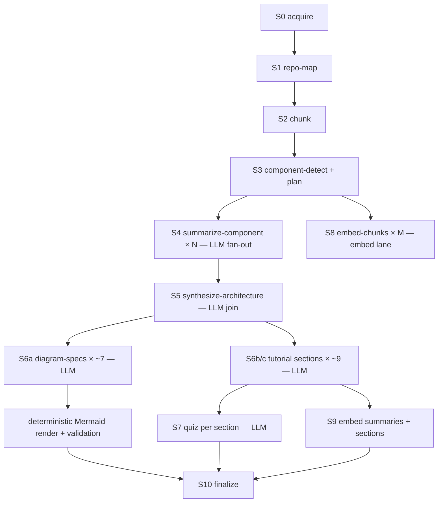

# 01 — Analysis pipeline

The job DAG from "repo URL submitted" to "tutorial ready". Stages S0–S3 and S10 are
deterministic (cpu lane); S4–S7 are LLM jobs (gpu-gen lane, concurrency 1); S8/S9 are
embedding jobs (gpu-embed lane).



Sections publish to the UI as each S6b job completes (**progressive publish**) — the
tutorial is readable long before quizzes and embeddings finish. Q&A unlocks when S9
completes (with a "knowledge base still indexing" banner if opened early).

## S0 — acquire (deterministic)

- `git clone --depth 200 --single-branch` — depth 200 yields useful churn/recency
  stats without unbounded history (configurable). Anonymous HTTPS, public repos only.
  No submodule recursion, no hooks.
- Hard limits: working tree ≤ 1 GB; abort at 2 GB transfer (watch `.git` growth) with
  a user-facing "repo too large" failure that offers subtree scoping.
- GitHub REST (anonymous; optional PAT env var for headroom): repo description,
  topics, default branch, license, releases, issue counts — ~5 requests per analysis
  against the anonymous 60/h limit. The clone is the source of truth.
- Snapshot pinned to a commit SHA. The checkout lives at `workspaces/{repoId}/{sha}`
  as a reap-able cache; generated artifacts (repo-map JSON, architecture JSON) go to
  the content-addressed object store.

### GitHub API enrichment (and why clone stays primary)

Acquisition is seconds-to-minutes while LLM inference is the ~1 h bottleneck, so no
API accelerates the core analysis — but specific endpoints improve specific paths:

- **PR files endpoint** (`GET /repos/{o}/{r}/pulls/{n}/files`) — pre-flight diff
  sizing and change classification for PR mode *before* cloning; lets the planner
  refuse or scope oversized PRs cheaply.
- **Tarball download** (`GET /repos/{o}/{r}/tarball/{ref}`) — one metered API call
  plus an unmetered codeload fetch; faster than a clone for a snapshot. Used in
  **quick mode** only, since it loses git history (churn stats feed S1 ranking).
- **Languages / contributor-stats / community-profile** — cheap cross-checks for the
  repo vitals card and S1's language table.
- **Code search** (`GET /search/code`, the Blackbird engine) — requires
  authentication (~10 req/min with a PAT), so unavailable in anonymous v1. Even
  authenticated it *searches* rather than summarizes; its future value is as a Q&A
  retrieval enrichment (cross-repo symbol lookup) once PAT configuration exists —
  a v2 item behind the same connector interface as private-repo support.

## S1 — repo map (deterministic)

One pass over the tree producing a `repo_map` artifact plus `files` rows.

**Filters, in order:** `.gitignore` (already applied by git) → built-in excludes
(`node_modules/`, `vendor/`, `dist/`, `build/`, `target/`, `.venv/`, `*.min.*`,
lockfiles, image/font/archive extensions) → NUL-byte sniff for binaries →
generated-file heuristics (`@generated` markers, `.designer.cs`, `_pb2.py`, average
line length > 300 → minified) → `.gitattributes` `linguist-generated` /
`linguist-vendored` honored → per-file cap 1 MB. Excluded files still appear in the
map with `role: excluded(reason)` so the tutorial can honestly say "vendored X".

**Extraction:** language by extension (embedded linguist-style table); build systems
(sln/csproj, package.json workspaces, pom/gradle, go.mod, Cargo.toml, pyproject,
Makefile); entry points; test roots; CI/CD configs (`.github/workflows/*`, Dockerfile,
compose, helm, release configs) parsed structurally (YAML→JSON) so the
build/test/release section narrates real facts; dependency manifests; README/docs
harvested (top ~50 KB each); git stats (per-file commit count, last-touched, top-churn
files, contributor count).

**Import graph (best effort):** regex-level import/using/require extraction per
language → file-to-file edges. Used only for ranking and component adjacency, so
precision matters more than recall.

**Hard caps:** ≤ 5,000 analyzable files, ≤ 25 MB chunkable text. Beyond that the
degradation ladder applies (see [06-llm-strategy](06-llm-strategy.md)).

## S2 — chunking (deterministic)

- Target ~2–4k tokens per chunk (~150–400 lines), split at top-level declaration
  boundaries detected by per-language regexes with brace/indent balance checks;
  fallback: fixed 300-line windows with 20-line overlap. No tree-sitter in v1 — the
  regex splitter is adequate for RAG granularity and avoids native bindings;
  tree-sitter is a contained v2 upgrade inside `CodeExploder.Analysis`.
- Each chunk: `file_id, start_line, end_line, content, token_estimate, sha256`,
  stored in Postgres with an FTS `tsvector` and a `pg_trgm` index for identifier
  search. Docs chunk heading-aware at ~1.5k tokens.
- A 2k-file repo typically yields 6k–15k chunks.

## S3 — component detection + run planning (deterministic)

- Components = project boundaries where manifests define them (one per csproj /
  workspace package / go module), else top-level directories; merged/split to land in
  **8–40 components** (merge tiny siblings; split any component > ~150 files).
- Files ranked per component: entry points and manifests first, then import-graph
  fan-in, then churn, then size — this ranking decides what gets packed into prompts.
- **The plan step** computes the full job fan-out, token-budget forecast, and model
  choice, writes it to `analyses.plan` (jsonb) — progress reporting is measured
  against this plan — then enqueues the S4 fan-out, the blocked S5 join, and S8
  embedding batches.

## S4–S7 — LLM stages

Prompts are versioned embedded resources (`Prompts/component-summary.v1.txt`, …);
every LLM output row records `model + prompt_version`. All outputs are JSON,
schema-validated with one repair retry (validator error appended); a second failure
stores a degraded result and flags the job.

**S4 summarize-component (× N).** Input packed ≤ 16k tokens: component manifest,
entry-point files verbatim, top-ranked file *heads* (first ~80 lines — imports + top
declarations, a cheap deterministic signature extraction), directory listing, relevant
README slice, inbound/outbound component edges. Output ≤ 1.2k tokens: structured JSON
`{purpose, responsibilities[], key_types[], external_deps[], talks_to[], data_flows[],
notable_files[], risks[]}` plus a 200-word prose summary.

**S5 synthesize-architecture (join on all S4).** Input: repo-map digest + all
structured summaries (≤ 55k tokens). Output: the **architecture JSON backbone** —
canonical component list, labeled relationship edges, 3–6 named product **scenarios**,
layering, and the tutorial outline. Diagrams, sections, and PR mode all consume this.

**S6a diagram specs.** The LLM emits `DiagramSpec` JSON — never Mermaid:

```json
{ "kind": "component|sequence|dataflow",
  "title": "...",
  "nodes": [{"id":"api","label":"Gateway","group":"backend","note":"..."}],
  "edges": [{"from":"api","to":"db","label":"SQL","step":2}],
  "reveal": [["api","web"],["db"],["queue","worker"]] }
```

`reveal` is an ordered list of node-sets — the progressive-whiteboard stages.
Validation is JSON-schema plus referential checks (edge endpoints exist, ids unique) —
fully deterministic. The backend/renderer produces syntactically valid Mermaid by
construction (labels sanitized at render time). The spec is *seeded* from the
deterministic component graph, so the LLM edits, labels, and orders rather than
invents. Calls: 1 context diagram, 1 component diagram, 1 per scenario (3–6),
1 data-flow ≈ 5–8 calls, each ~10k in / 1.5k out (input is architecture JSON, not code).

**S6b/c tutorial sections (× ~7–10).** Fixed outline: intro (README + metadata +
architecture overview) → architecture walkthrough (one section per diagram/scenario;
input = architecture JSON + relevant summaries + 2–3 key chunks) → build/test/release
(input = parsed CI/build/release facts; the LLM narrates deterministic data). Output:
markdown ≤ 2k tokens with inline `{{cite:path/to/file.cs:120-180}}` tokens, resolved
against the `files` table — invalid paths are dropped and logged (hallucination guard).

**S7 quizzes (× sections, cheap).** Input: section markdown only (~3k). Output: JSON,
3–4 auto-gradable questions (single/multi/boolean) plus at most one short-answer with
a key-point rubric. See [05-ux](05-ux.md) for grading design.

## S8/S9 — embeddings

`nomic-embed-text` via Ollama `/api/embed` (768-dim, ~270 MB — co-resident with the
generation model within 24 GB). Batches of 128 chunks (a 2k-file repo → ~50–120 jobs,
seconds each) on the embed lane, interleaving with S4 — Ollama serializes GPU work
internally and embed batches are cheap. Corpora: code chunks, doc chunks, component
summaries, tutorial sections.

## Token budget (2k-file repo) — enforced, not hoped

| Stage | Calls | In/call | Out/call | Prompt tok | Output tok |
|---|---|---|---|---|---|
| S4 summarize | ~30 | ≤16k | ≤1.2k | ~480k | ~36k |
| S5 synthesize | 1 | ≤55k | ≤6k | 55k | 6k |
| S6a diagrams | ~7 | ≤10k | ≤1.5k | 70k | 10k |
| S6b/c sections | ~9 | ≤12k | ≤2k | 108k | 18k |
| S7 quizzes | ~9 | ≤4k | ≤1.5k | 36k | 13k |
| **Total** | **~56** | | | **~750k** | **~83k** |

The S3 planner computes this budget and the packers truncate (dropping lowest-ranked
material) to hit per-call ceilings. Expected wall clock on an idle GPU: **~55–80 min**
(intro readable ~20 min in); small repos (≤ 200 files): ~10–15 min. ETAs shown in the
UI derive from the plan plus live tokens/second measurement.

## PR-diff mode

Same machinery, different *plan* — not a different pipeline.

**Flow:** PR URL → GitHub REST for metadata (title, body, linked issues, commits,
base/head SHAs) and pre-flight sizing via the files endpoint → clone base at base SHA,
`git fetch origin pull/{n}/head` → deterministic `pr-diff-map`: changed files, hunks
with line maps, change classification (new/deleted/renamed/modified, test-vs-prod),
mapped onto components.

**Incremental path** (a base analysis exists; reused when merge-base distance ≤ 200
commits and touched components are ≥ 90 % unchanged — otherwise a lite refresh of
drifted components first):

- `summarize-change` per touched component (base summary + hunks + surrounding chunk
  context, ≤ 12k in);
- `pr-synthesize` — the PR narrative: intent, approach, risk areas, suggested review
  order;
- diagrams by **deterministic overlay** — badge/recolor changed nodes on the existing
  component `DiagramSpec` (no LLM), plus at most one new sequence diagram if the PR
  alters a scenario;
- PR walkthrough sections ordered bottom-up by dependency; one quiz for the whole PR;
- embed only changed chunks + PR summaries. Q&A retrieval filters
  `analysis_id IN (base, pr)` with PR-layer boosts; base chunks superseded by changed
  files are masked.

Typical incremental PR: **5–15 LLM calls — minutes, not an hour.**

**Cold path** (no base analysis): run a *lite* base pass first — S0–S3 for the whole
repo, S4 only for touched components plus their 1-hop neighbors in the component
graph, S5 marked "partial" — then the PR plan.
