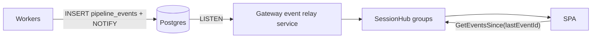

# 02 — Job queue and event bus

## Base: Postgres-as-queue

The queue is a Postgres table, adopted wholesale from the reference app's proven
design — no Hangfire, no broker:

- Dequeue via `UPDATE ... WHERE id = (SELECT ... FOR UPDATE SKIP LOCKED)` ordered by
  `priority DESC, available_at ASC NULLS LAST, created_at ASC`, so any number of
  workers poll concurrently and safely.
- Retries via `attempts` / `max_attempts` (default 3); `FailAsync` requeues or marks
  failed. Starved-output LLM responses are a retryable failure class.
- Leases: the Orchestrator's reaper requeues jobs whose worker died
  (`locked_at` expiry); a retention service purges finished jobs.
- Workers are separate executables hosting `BackgroundService` pollers
  (poll → handle → complete/fail, ~2 s idle delay).

## Minimal DAG extension: counting joins

The base queue has no fan-out/join primitive. Three columns and two statuses add one:

```sql
ALTER TABLE jobs
  ADD COLUMN analysis_id     uuid,          -- scoping, progress, cancellation
  ADD COLUMN unblocks_job_id uuid,          -- child → join edge
  ADD COLUMN blocked_count   int NOT NULL DEFAULT 0;
-- status check constraint gains 'blocked' and 'cancelled'
```

- The planner enqueues a join job (e.g. `synthesize`) with `status='blocked',
  blocked_count=N`, then the N children each carrying `unblocks_job_id`.
- `CompleteAsync` and *terminal* `FailAsync` both decrement, in the same transaction
  as the child's status update:

  ```sql
  UPDATE jobs
     SET blocked_count = blocked_count - 1,
         status = CASE WHEN blocked_count - 1 = 0 THEN 'queued' ELSE status END
   WHERE id = $unblocks AND status = 'blocked';
  ```

  Atomic under row locking; no separate coordinator. The `status='blocked'` predicate
  guards against double-decrement from reaped-then-retried children (decrement happens
  only on the transition *into* a terminal status).
- **Terminal failure also decrements** so a dead component summary cannot wedge the
  run. The join job queries what actually succeeded and proceeds with gaps; the
  analysis ends `ready_with_warnings` if any child failed. Only S0–S3 and S5 failures
  are fatal.
- Multi-level DAGs compose: S5's completion enqueues the S6 fan-out and the S10 join.

This is the *entire* DAG machinery.

## Lanes and concurrency

| Lane (worker exe) | Concurrency | Job types |
|---|---|---|
| `cpu` (Workers.Analysis) | 2–4 | acquire, repo-map, chunk, plan, pr-diff-map, render-diagrams, finalize |
| `gpu-gen` (Workers.Llm) | **1** | summarize-component, synthesize, diagram-spec, tutorial-section, quiz, qa-answer, grade-quiz, deep-dive, pr-* LLM jobs |
| `gpu-embed` (Workers.Llm) | 1 | embed-batch (query embedding runs inline inside qa-answer) |

Concurrency is poller count per worker process, not queue configuration. If a second
Ollama parallel slot ever becomes safe (VRAM/context budget), scaling is "run a second
gen poller" — no schema change.

## Priorities: interactive vs batch vs idle

- **Interactive** (`qa-answer`, `grade-quiz`, on-demand `deep-dive`): priority 100.
- **Batch** (analysis stages): priority 0–20, later stages slightly higher so an
  almost-done run finishes before a new run's fan-out floods in, plus a small
  per-analysis decay so concurrent runs complete roughly FIFO.
- **Idle** (see below): negative priority.

The queue is non-preemptive, so worst-case interactive wait = one in-flight batch job.
That is why every batch job is sized ≤ ~90 s by construction (input/output token
ceilings). The UI surfaces queue position ("the expert is finishing another
thought…").

### Idle/overnight lane

A third tier below batch for work that should soak up unused GPU time: negative
priority plus `available_at` set to the next configured idle window
(`Queue:IdleWindow`, e.g. 01:00–07:00); the gpu-gen worker additionally gates idle
jobs on "no batch/interactive work waiting". Uses:

1. **Night-shift upgrades** — a large repo that ran in breadth mode gets full-depth
   S4 summaries and embeddings enqueued overnight, publishing an upgraded experience
   version by morning.
2. Pre-generating all on-demand deep dives for recently active sessions.
3. Embedding-coverage top-ups for corpora that were sampled under caps.
4. Periodic staleness checks ("N commits behind") for recently opened sessions.

Idle jobs are individually cancellable and yield instantly to interactive work (same
≤ 90 s sizing).

## Idempotency, cancellation, progress

- **Idempotency**: every job's writes are upserts keyed on natural keys
  (`analysis_id + component_id`, `analysis_id + section ordinal`, chunk sha). A
  retried job overwrites its own partial output.
- **Cancellation**: `analyses.cancel_requested` flag; the Gateway sets it, one
  statement flips that analysis's `queued|blocked` jobs to `cancelled`, and running
  workers check the flag between LLM calls, aborting the in-flight HTTP request to
  Ollama (which stops generation).
- **Progress**: the stored plan fixes total counts per stage; every completion
  publishes `AnalysisProgress {stage, done, total, etaSeconds}`.

## Event bus: Postgres NOTIFY → relay → SignalR



- Workers publish envelopes via `NOTIFY`; a Gateway `BackgroundService` `LISTEN`s and
  fans out to SignalR groups (`session:{id}`, `user:{subject}`).
- Durable events also land in `pipeline_events` for reconnect catch-up via the hub's
  `GetEventsSince(sessionId, sinceId)`.
- Token deltas (Q&A streaming, and "watch the expert think" narration for the
  currently running generation job) use the same bus with coalesced flushes
  (~100 ms / 512 chars) and are *not* persisted per token; the streaming message row
  is flushed ~1/s as a reconnect fallback.

The full event catalog and client-side handling rules are in [04-api](04-api.md).
